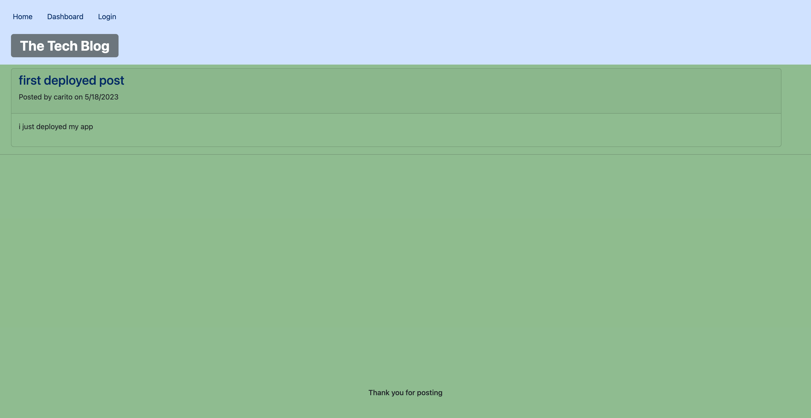

# Tech-Blog-MVC

## Description

    This website is designed for developers who writes about tech and want publish 
    articles, blog posts, thoughts and opinions. 
    It's a space to help and cheer each other in the tech world. 

## Installation

    None, just click on the link and post/comment away. 

## Technologies 

    The technologies used for this website are:
    * Handlebars
    * Express
    * Sequelize
    * Sessions
    * Bcrypt
    * Mysql
    * Bootstrap 

## Credits

    I've used all the material provided in class. 

## License

    None.

## Links
    Deployed app : https://techblogmvcch.herokuapp.com/
    GitHub repo:https://github.com/caroHagg

## Screenshot

